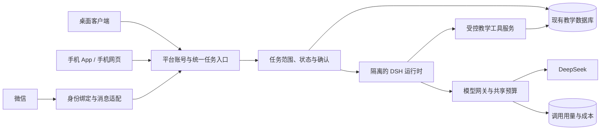

# DSH 教师助手产品规划

日期：2026-09-11（洛杉矶）／2026-09-12（UTC）。状态：下一版规划建议，未开始新功能实现。

产品决定以 [PRODUCT.md](/Users/xiaosi/Developer/active/apps/teacher-platform-formal/PRODUCT.md) 的“下一版产品方向”为准；执行和验收以 [PROJECT_LOG.md](/Users/xiaosi/Developer/active/apps/teacher-platform-formal/PROJECT_LOG.md) 为准。本文件提供设计细化与证据，不替代二者。当前交付基线仍为 V008，工程进度仍为 43%。

## 1. 产品定位与已知边界

建议定位：**开发者统一提供 DeepSeek 能力的教师工作助手，让教师在电脑、手机与微信之间接续教学工作，并持续积累可信的学生档案。**

用户本轮已明确：开发者承担前期模型费用；后期开放付费；先考虑成本统计接口；仅处理现有项目范围内的教学工作；支持桌面安装程序、电脑和手机同步、从产品入口扫码连接微信并交互。本轮授权继续规划，不等于启用真实 Key、微信、付费、部署或上传教学资料。

以下是建议，尚不视为用户逐项确认：云端持续执行、电脑关闭后手机仍可用；免费期共享额度；微信私聊优先、通过页面完成高影响确认；订阅过期保留已有数据的人工使用。原生手机 App 范围与公共/独立 Bot 模式尚待用户回答。

对教师的起步流程建议为：接受邀请 → 登录 → 填少量教学偏好 → 建立/选择学生 → 开始使用 → 按需连接微信。无需接触 Key、模型路由、DSH、AGENTS.md 或插件安装。

## 2. 以现有功能定义“教学相关”

“和教学有关”过于宽泛。首版应按当前模块及数据操作定义能力，不能仅按是否包含“老师、教学”等词放行。

下表定义下一版目标能力，不是已交付清单；各模块的当前完成状态仍以 PROJECT_LOG 为准。

| 教师要完成的工作 | 现有模块 | Agent 可提供的帮助 | 写入与输出规则 |
|---|---|---|---|
| 安排今天和接下来的课程 | TODAY、SCHEDULE、REVIEW | 查询课程/冲突/待办，生成改期或重复安排候选 | 改期、取消、重复规则变更遵循现有确认；课程摘要仍只有时间、对象、地点 |
| 维护学生基本资料 | STUDENT | 查找学生、发现同名歧义、提出资料修订 | 使用稳定学生 ID；改名不新建身份、不改变余额 |
| 留下课后观察和作业/成绩事实 | INPUT、EVIDENCE、RECORD | 从输入整理候选，提醒缺少的时间、学生和来源 | 教师核对后归档；不把推测写成事实，不自动阅卷或给学生贴长期标签 |
| 回顾一个学生的变化 | TIMELINE、RECORD | 按学生、时间、类别查可信记录，给出附来源的归纳 | 当前事实以数据库为准；资料不足明确说明，修订后旧摘要失效 |
| 准备家长反馈和记录沟通 | COMM、REPORT | 从允许分享的已确认记录生成现有九部分报告或沟通草稿 | 教师核对后复制/导出并自行发送；来源不足不能编造进步和评价 |
| 核对课时和缴费 | LEDGER | 查余额、解释流水、提出完课或调整操作 | 余额由账本计算；高影响操作逐次确认，重复请求不重复扣课 |
| 跟进教学工作 | REVIEW、COMM | 保存候选备忘，整理回顾和后续事项 | 沿用现有保存与确认规则；不顺带开启微信主动催办 |
| 使用与管理产品 | ACC、PRIVACY、FEEDBACK | 解释页面、连接入口、额度和失败恢复，指向反馈或数据管理页面 | 属于产品支持；优先确定性导航，不授予教师管理员权限 |

备课若仅指“查看下节课安排、上次记录和跟进事项”，属于上述范围；通用教案生成、出题、自动批改、无限学科答疑、联网研究或内容营销，目前不能仅因属于教育主题就加入首版承诺。闲聊、理财、娱乐、通用代码生成等超出本产品任务时，用简短提示引回支持的工作。

对“把刚才那段写得更简洁”“继续”“他上次怎么样”保留有效会话语境；不能每一轮重新做孤立关键词判断。涉及同名学生、指代不清或切换对象，先澄清，再读取或写入资料。

建议后端执行顺序：身份与绑定校验 → 任务范围判断 → 按任务配置可用工具和数据 → 预算检查 → 执行 → 结果核验与确认。范围分类器只决定是否进入任务，不能授予权限。模型传入的 teacherId、approved、任意 SQL、任意 URL 均不能成为授权依据。资料中的命令性文字按资料处理；即使伪装成教学请求，也不能越过工具权限。

当前主对话链有工具和确认网关，但本轮核查未发现统一的教学任务范围校验。现有 local-safe 工具过滤处理的是操作风险，不能替代教学范围控制。证据：[工具注册执行](/Users/xiaosi/Developer/active/apps/teacher-platform-formal/packages/backend/src/shared/tool-registry/tool-registry.ts)、[主对话流程](/Users/xiaosi/Developer/active/apps/teacher-platform-formal/packages/backend/src/app/use-cases/agent-converse/agent-converse-use-case.ts:126)。

## 3. 统一提供 DeepSeek：成本接口需要真正记录用量

### 3.1 服务端持有 Key

开发者向教师提供 AI 服务，不向教师发放自己的原始 API Key。所有端使用平台账号凭据；DSH Worker 通过带教师/任务限制的内部调用授权访问模型网关，网关读取服务端密钥并调用 DeepSeek。Key 轮换、吊销、异常停用由平台统一管理；不写入安装包、移动端、AGENTS.md、二维码、微信消息或普通日志。

服务端锁定官方 DeepSeek 端点及经过验证的模型白名单，模型价格/能力变化通过版本化配置管理。用户界面可以显示“快速整理”“深入分析”等经过评测的工作模式，无需教师选供应商；这些模式暂是设计建议，不是已可用能力。

现有 [模型路由](/Users/xiaosi/Developer/active/apps/teacher-platform-formal/packages/backend/src/shared/ai-client/routing-ai-client.ts:78) 在无教师上下文或解析失败时会退到默认 provider。下一版必须明确拒绝丢失身份或 DeepSeek 不可用的调用，不能退到 ARK 等其他供应商。旧教师配置作为兼容数据保留，本轮不自动迁移凭据或删除配置。

下一版统一网关不读取、解密或使用旧教师 ProviderConfig 中的密钥，新助手界面以平台权益和服务状态替代自配 API 入口。保留旧配置不代表保留旧调用路径；后续留存/清理策略单独明确，本轮不更改 V008 运行行为。

### 3.2 已有统计可以复用，但不是完整成本账

本轮静态核查确认：

- [ProviderUsage](/Users/xiaosi/Developer/active/apps/teacher-platform-formal/packages/contracts/prisma/accounts-channels.prisma:111) 已有教师、provider、model、输入/输出 token 和时间；estimatedCostUsd 仍是可空预留字段。
- [用量记录服务](/Users/xiaosi/Developer/active/apps/teacher-platform-formal/packages/backend/src/features/provider-usage/provider-usage-service.ts:61) 优先采用供应商 token，无则估算；当前主要由成功调用触发，未覆盖失败成本、请求尝试与功能归因的完整状态。路由回调未传 conversationId，不能只因表有字段就声称可查每次会话成本。
- [管理员汇总](/Users/xiaosi/Developer/active/apps/teacher-platform-formal/packages/backend/src/features/admin/admin-usage-summary.ts:42) 已能汇总次数/token，未形成金额与功能成本看板。
- [当前预算](/Users/xiaosi/Developer/active/apps/teacher-platform-formal/packages/backend/src/shared/agent-cost/agent-cost.ts:77) 放在进程内 Map，无法承担多实例、多端并发的统一额度。主对话的预检还以输入估计为主，不是实际账务结算。
- 现有 MediaAsset 的 OCR/ASR 外部适配与普通模型调用统计并非同一完整链；未来 DSH 的标题、摘要压缩、范围分类等隐藏调用也必须归因。当前本地截断压缩不应虚构成已发生付费调用。

建议免费期就实现一张可靠的调用尝试流水，而不只建一个暂不写数据的接口。最低字段如下，命名为设计草案：

| 信息 | 最低记录要求 |
|---|---|
| 归属 | teacherId、taskId、conversationId、channel、featureCode、operation |
| 请求身份 | 业务请求 ID、独立 attemptId、供应商请求 ID（有则记）、幂等事件 ID |
| 供应商 | 实际 provider、请求模型、响应模型、密钥引用 ID；不保存 Key |
| 结果 | started/succeeded/failed/cancelled、失败类别、开始/结束时间、延迟、是否重试 |
| 用量证据 | 输入、缓存命中/未命中、输出、可用的推理明细；actual/estimated/unknown |
| 费用依据 | 定点金额或最小货币单位、币种、priceVersion、生效时间/时段、计算状态；供应商对账差异单独保留 |

每次真实重试独立计一次潜在供应商消耗，同一次尝试的重复回调只登记一次；“不重复执行业务操作”和“不漏掉已发生的模型成本”要分别验证。连接中断、流式最后用量未收到、请求取消时不能默认成本为零，也不能凭文本估算标成供应商实测。

用量须跟随本次响应绑定 attemptId，避免并发请求依赖共享可变的“最近一次用量”字段而错配教师或任务；这是统一网关的接口要求，不以当前代码的局部 token 记录代替并发验收。

DeepSeek 官方返回缓存命中/未命中及输出等用量明细，定价区分缓存与时段，因此金额不能简单按总 token 乘同一个单价。推理明细属于输出统计的细分时不可重复加总；以实际接口版本为准。设计判断依据：[官方用量字段](https://api-docs.deepseek.com/api/create-chat-completion/)、[官方定价](https://api-docs.deepseek.com/quick_start/pricing/)。本规划不锁死当前价格，也不把本地估算称作供应商最终账单。

### 3.3 共享预算与后续付费接口

建议先定义四个内部职责，后续再冻结 API/数据库迁移契约：

| 逻辑接口 | 作用 | 必须满足的规则 |
|---|---|---|
| Entitlement.resolve | 返回当前教师可用功能和额度政策 | 免费/未来付费统一查询，不依赖具体渠道 |
| Budget.reserve | 每次外部调用前预留消耗 | 教师额度、试用共享池、平台总额原子校验；并发限制、任务步数/输出上限一起生效 |
| UsageMeter.recordAttempt | 幂等记录每次真实尝试 | 支持成功、失败、未知；不采集教学正文和密钥作成本维度 |
| Budget.settle | 按已知用量结算并释放确定未使用部分 | 调用租约和过期恢复；费用未知保留待核对项，不能超时后无条件当作零费用退款 |

预留金额是风险控制上界，不是向教师收费。供应商响应延迟、价格调整和未知费用可能造成对账差异，需保守余量、平台熔断和对账；不要承诺离线估计能保证供应商账单绝无偏差。每日额度按明确业务时区和服务端可信时间重置，多个设备/重启不能获得额外额度。

管理员先看总消耗、每教师消耗、每类任务成本、失败重试成本、每个成功教学任务的平均成本、预算余额和异常集中调用。模型成本与服务器、存储、微信接入等运营成本分项，分摊值不能伪装成直接实测值。统计界面默认不暴露学生姓名、教学文本或微信聊天正文。

教师只需知道免费权益、使用情况、超额后何时恢复，以及资料是否已保存。建议前期沿用邀请制控制试用规模；平台总开关、单教师并发/频率/附件/长任务限制在真实免费试用前就具备。免费额度和总月预算暂无用户确认数字，不从现有进程内默认值推导商业额度。

未来收费建议通过独立平台订阅/权益领域扩展。**平台向教师收的软件服务费，与教师向学生收的学费是两套业务。** 不复用 Payment、LessonLedgerEntry 或学生余额。先预留权益状态与稳定关联标识，订单、支付渠道、续费和退款规则后续另做；当前不假定按 token 向教师收费。建议额度耗尽或订阅到期只停止新的 AI 调用，保留既有资料的查看、导出和人工维护。

## 4. 微信接入：已有框架，真实扫码尚未打通

### 4.1 当前能复用与不能视作完成的部分

当前代码围绕 iLink 账号绑定预留，不是已完成的公众号登录或公共 Bot 服务：

| 内容 | 当前证据 | 下一步 |
|---|---|---|
| 生成连接入口 | [二维码路由](/Users/xiaosi/Developer/active/apps/teacher-platform-formal/packages/backend/src/features/wechat/wechat-login.routes.ts:157) 仍拼接占位 URL | 换成供应商真实 QR 创建与轮询流程，保留平台绑定状态 |
| 交换身份/凭据 | [CodeExchanger](/Users/xiaosi/Developer/active/apps/teacher-platform-formal/packages/backend/src/features/wechat/code-exchanger.ts) 默认 unavailable | 按官方协议重做适配；不能把旧 OAuth 式 callback 当成已匹配 iLink |
| 识别教师 | ChannelIdentity 保存绑定；未登录不自动创建教师账号 | 扩充 provider 账号命名空间，绑定/重绑/解绑原子处理 |
| 入站、出站与主 Agent | [装配](/Users/xiaosi/Developer/active/apps/teacher-platform-formal/packages/backend/src/app/composition/wechat-assembly.ts:115) 复用平台 agentConverse，有幂等、分块和状态代码 | 保留有用结构；内存状态/队列升级为持久化任务与租约，真实协议另验 |
| 确认接续 | [微信 Agent 适配](/Users/xiaosi/Developer/active/apps/teacher-platform-formal/packages/backend/src/features/wechat/agent-loop.ts:7) 将主流程输出收窄为 reply | 保留 taskId、executionId、waiting_confirmation、结果链接等结构信息 |

上述“有代码”不等于真实微信可用。本轮未扫码、未读取真实微信凭据、未收发消息。当前预留边界见 [微信接口预留记录](/Users/xiaosi/Developer/active/apps/teacher-platform-formal/evidence/product/WECHAT-interface-reservation.md)。

已核查腾讯官方 [openclaw-weixin 源码](https://github.com/Tencent/openclaw-weixin/tree/7c04adc3e95775efd661ab9fba0626d86d237713)。其 QR 流程是创建二维码、轮询状态，确认后取得 Bot 凭据、Bot ID 和扫码用户 ID；参考实现还有长轮询和会话隔离。文档明确其描述客户端行为，不是完整服务器契约。可用性、容量及公共 Bot 模式仍需另验。[官方协议](https://github.com/Tencent/openclaw-weixin/blob/7c04adc3e95775efd661ab9fba0626d86d237713/docs/protocol.md)

这为自建微信通道提供了源码依据，但 OpenClaw 插件不能直接当成 DSH 插件加载。建议只移植/适配需要的传输协议与身份层，继续复用教师平台主业务，避免为微信再加入一套并行 Agent。

### 4.2 推荐绑定流程

1. 教师在任一产品端登录自己的平台账户，进入“连接微信”，了解本次连接只用于自己的教师助手。
2. 服务端创建短时、一次性的绑定会话，关联平台教师、目标 Bot 配置、当前账号会话及过期时间。
3. 展示供应商真实二维码和明确状态；扫码待确认、过期、需要验证码、失败分别反馈，不提前显示“已连接”。
4. 服务端取得已验证的外部身份后，校验绑定会话及既有归属；原子保存教师、provider 账号/Bot、扫码身份、绑定版本和审计信息。不得凭一个微信昵称或模型文本认定身份。
5. 教师可以主动发送一句测试消息；页面分别显示“账号已连接”和“消息通道已验证”，两者不混为一次假成功。每个客户端查看同一绑定状态，不各扫一次产生多份账户。
6. 解绑立即停止该绑定的新消息处理并失效未完成确认授权；撤销/删除本地保管的对应通道凭据，供应商侧撤销如不可用须明确状态。重绑产生新版本，旧事件不能作用于新教师。解绑不删除教学档案。

同一部手机既打开网页/App 又运行微信时，不能假设能直接用摄像头扫描本屏二维码。需验证供应商支持的同机连接方式，并提供等效操作指引；不凭空承诺“打开微信”深链或长按识别一定支持。必要时明确需另一屏幕展示二维码，不能将这当作已达到理想同机体验。

微信“绑定现有教师账户”和“用微信登录平台”是不同功能。用户本轮要求前者，不能顺带开放微信注册或替代平台认证。

### 4.3 推荐微信工作流程

例：教师在微信说“记录小明今天课上能自己检查计算过程，但应用题还需要提示”。系统定位学生并形成待核对候选；同名时先询问。微信返回简短摘要与“核对并保存”链接；教师在手机已登录页面核对，保存后电脑也能看到同一条记录和原始来源。

例：教师说“今天这节课上完了，扣一课时”。先明确课程及参与学生，展示影响；通过一次性、短期、绑定教师和数据版本的页面确认后才执行。不得只凭微信中一个脱离上下文的“确认”改变账本。同一操作在电脑与手机同时确认，仍只执行一次。

例：教师说“根据最近一个月的记录写一份家长反馈”。系统读取当前允许分享的已确认记录，生成草稿，微信给出短摘要和查看链接；长报告在网页/App 中核对，教师自行发给家长。

首批建议仅覆盖教师与助手的私聊。群聊、读取好友/历史聊天、自动给家长发消息、网页操作触发主动微信提醒均不随此次连接能力自动加入。跨端同步表现为平台内可见的任务和资料，不意味着所有平台会话都复制发送到微信。

文字先完成真实闭环，图片按现有候选和媒体限制接续。腾讯协议的语音文本字段是可选值，缺少转写时不能假装已经理解音频；DeepSeek-only 是否覆盖全部语音转写仍无已验收证据，保留音频/提示转文字，其他转写供应商不自动启用。通道能传文件或视频，也不改变当前首批不支持 PDF/视频/大批量导入的产品范围。

### 4.4 状态与恢复

平台需分别记录：业务任务是否完成、回复是否生成、微信发送是否确认。HTTP 成功或模型回答完成不能直接标成教师已收到。发送超时标记“送达待核对”，采用有限恢复；同一个 client_id 或分块编号只能支持追踪，不能单靠它宣称供应商恰好发送一次。

入站去重建议包含 provider、providerAccountId、externalMessageId，绑定版本另用于拒绝过期事件；外部会话映射包含账号与聊天对象。无有效绑定的消息不能启动付费模型或读取教师档案。持久化长轮询游标、消息处理租约和任务状态，重启后不丢任务、也不重复扣课。

## 5. 多端同步与记忆一起设计

建议架构如下，部署位置与真实服务预算尚未实施：

三端/多端共用账号、学生资料、任务、草稿和额度。微信会话在 App/网页中可找到，用户可明确选择继续该任务；新开会话不自动混入所有历史。服务端保证一个任务只有一个有效执行者，避免两个端接续造成重复运行。手机网络断开时区分本机草稿、待提交和云端已保存，首版不承诺完整离线执行；恢复上传带同一个请求 ID 防止重复建档。

记忆保留三类：

| 教师看到的含义 | 真正存储 | 更新规则 |
|---|---|---|
| 记住我的习惯 | 教师偏好/工作背景 | 可查看、更正、删除；稳定偏好由教师确认 |
| 记住学生的变化 | 已确认学生事实、来源、发生时间、修订关系 | 数据库权威；候选不能悄悄晋升事实；当前余额/课表实时查 |
| 接着上次的工作 | 会话、候选、草稿、PendingAction、任务状态 | 以 taskId/学生 ID 接续；“当前学生”是任务上下文，不能永久记成默认对象 |

AGENTS.md 放少量稳定规则和工具使用说明，不存学生档案或 Key。DSH 原生日志用于执行恢复，教师可见任务/记录仍以平台为准；不同教师的 runtime 工作区、会话和工具上下文必须隔离。摘要是可重建缓存，应带来源 ID/版本、生成时间和失效标志；删除或更正原始记录后使相关摘要、报告草稿和索引失效，历史审计按既有保留规则处理。

现有普通 Agent 对话尚缺学生长期事实的通用受控检索；优先把现有时间线和来源规则接成按学生、时间、类别的查询服务。首批不新增向量数据库或另一家 embedding 服务。成本收益也更直接：少带无关历史、更容易说明依据、更正能及时生效。

DSH 选型依据见 [前轮源码评估](/Users/xiaosi/Developer/research/teacher-platform-dsh-2026-09-12/MIGRATION-ASSESSMENT.md)。固定核查提交为 c291e7961a515f6d7af9304e7fd1d257929aef26，属于开发预览；不能把默认可运行 shell/文件系统的 profile 直接暴露成教师平台的公共服务。建议保留现有 React/业务后端/数据库，DSH 作为内部 AI 运行组件；封闭教学工具、禁用无关遥测与任意插件，桌面发行能力单独验收。

## 6. 对现有项目应优先补齐的内容

新增渠道会放大当前工作闭环的缺口。建议优先级如下：

| 优先级 | 需补齐的内容 | 为什么影响此次方向 |
|---|---|---|
| P0 | 未确认候选收件箱、处理中/失败恢复、来源与归属 | 微信输入没有核对入口就只能停留在聊天文本 |
| P0 | 学生长期记录查询和当前学生消歧 | 多端接续不能靠模型猜“他是谁”或反复要求重贴档案 |
| P0 | 统一 DeepSeek-only 调用、成本流水、预算/权益 | 开发者付费后必须覆盖全部渠道与隐藏调用 |
| P0 | 教学任务政策、工具权限、任务确认与跨端幂等 | 换成 DSH 或微信不能改变真实写入边界 |
| P0 | 微信真实绑定、解绑、持久消息和确认链接 | 现有占位流程无法作为用户可用性的依据 |
| P1 | 完整结构化记录/时间线、报告证据核对 | 现有后端与局部实现不等于完整网页已验收 |
| P1 | 有原因的课时调整/状态更正及对账页面 | Agent 提出变更后，教师必须能看懂并核对影响 |
| P1 | 媒体删除、派生记忆失效、导出、运行异常后台 | 多端和云端扩大副本与故障面，需要可追踪处理 |
| P1 | 桌面安装/更新/卸载、手机布局与连接路径 | 同步服务可用后才验收安装程序和设备体验 |

不因重做入口撤销原有规则：课程摘要不展示授课内容；已完成课程修订不重扣；课时流水不可随意覆盖；家长材料只使用允许分享的可信记录；管理员默认不看教学内容；当前邀请制及既有媒体大小/保留约定继续作为设计基线。

## 7. 分阶段交付与验收建议

| 阶段 | 应得到的结果 | 关键通过条件 |
|---|---|---|
| 规划收口（本轮） | 更新产品方向、功能范围、成本接口、渠道身份与开放问题 | 用户目标与建议区分清楚；证据能定位；不冒报实现完成 |
| 统一平台能力 | 教学任务入口、DeepSeek 网关、用量预算、档案检索、确认状态 | 双教师隔离；无其他供应商回退；多端共用额度；候选与事实分离 |
| 微信文字闭环 | 登录后连接、私聊录入/查询、打开任务、确认、解绑与恢复 | 真实协议验证；无重复写入；失效绑定不再访问教师资料 |
| 多端完整教学闭环 | 电脑/手机接续记录、排课、完课、对账、报告 | 不依赖电脑常开（建议目标）；弱网不假保存；相同操作只执行一次 |
| 安装与媒体体验 | 桌面安装/更新；已确定的手机形态；通过验收的图片/语音 | 真机平台验证，格式和供应商可用性有证据，不把占位界面当服务 |
| 真实免费试用 | 受邀教师可用，开发者能解释成本与故障 | 先确定总预算和个人权益；供应商/部署/资料传输边界获授权后开启 |
| 付费版 | 已定义的套餐权益及独立订阅/订单领域 | 价格依据来自实际使用；不污染学生账本；到期与恢复行为明确 |

重点场景至少覆盖：

1. 微信形成候选，手机确认，电脑看见同一事实和来源；没有额外“微信版学生”。
2. 两端同时确认同一次完课，课时只扣一次；修改已完成课程不再扣课。
3. 教师 A 不能通过扫码、篡改学生 ID、任务链接或提示词读取教师 B 的资料。
4. 原事实修订后，新的回答不再引用旧结论；历史报告可解释其当时来源版本。
5. 电脑、手机、微信同时触发调用，共享预算不分别发放；真实重试有独立消耗记录，重复回调不重复计入。
6. 失败/取消且供应商用量未知时显示待核对，不能当零成本，也不能将文本估算标成实测。
7. 超出教学任务范围时所有渠道一致收束；合理的后续编辑和产品支持不会被误拒绝。
8. 微信已连接但未验证收发、二维码过期、同机扫码困难、解绑重绑都呈现真实状态。
9. 业务完成但微信发送超时，平台仍可查看结果；不重复执行业务来补一次消息。
10. 无 Key、供应商故障、预算耗尽时 AI 清楚说明不可用，已有人工工作仍可继续。

## 8. 仍需决定的事项与证据限制

两项已向用户发出简短问题，未收到答案前不按界面预选值冻结：微信独立 Bot/平台统一 Bot；App 是否包含独立安装的 iOS/Android 手机应用。另在真实试用前需要确定总预算、免费权益及云端服务/凭据使用边界。

真实微信可用性、共享 Bot 服务模式、150 教师容量、同机连接、语音覆盖、移动端发行均未完成实测。源码兼容性评估不构成供应商服务承诺；本轮未实现这些功能，也未调用真实模型或发送微信。

本轮依据当前 V008 文档及带既有修改的工作树，不能只用 Git HEAD 推断当前全部功能。主 Agent 核对原始源码，独立 Agent 分别审查成本链和微信链，另安排产品边界复核。文档验证和复核结果登记在 PROJECT_LOG，不运行与文档改动无关的构建/测试。
