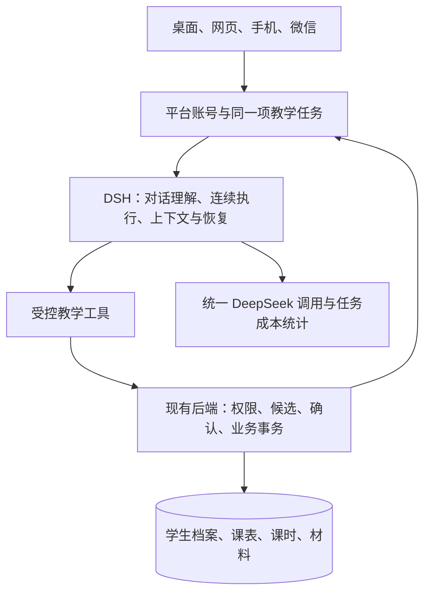

# V009：DeepSeek Harness 重设计与前后端评估合并

日期：2026-09-14（洛杉矶）。设计修订：R2，合并用户指定的前后端审计。状态：源码复核后的设计建议，尚未实现或获得用户交互验收。功能需求继续以 PRODUCT.md V009 为准，本文件不增加已确认功能、不代替用户的待决定项。

**合并结论：现有业务后端值得保留，但仍有接口和业务规则缺口；正式前端已接通部分人工业务，V009 原型尚未持久化，DSH 尚未接入。下一步以同一项教学任务串起这三部分，并对每个实际结果验收。**

合并来源：[教师平台前后端功能逻辑差异表](/Users/xiaosi/Developer/artifacts/teacher-platform-formal/frontend-backend-audit-2026-09-14.md)。该报告覆盖 F01–F20 共 32 项细分能力，作为当前实现与差异证据；PRODUCT.md 仍决定功能目标，报告中的建议或原型行为不自动成为已确认业务规则。原报告保留不改写。

## 1. 当前问题

用户先指出“AI 交互的页面呢”，随后追问“有结合 DeepSeek Harness 来重新设计吗”。V009-P1 的核心缺陷是：功能仍按管理页面组织，AI 只有预置入口与未连接的输入框；没有把 DSH 的会话、连续执行、业务内容展示及恢复机制落到教师工作流程中。

此前做过 DSH 技术评估，但不能据此声称该原型已结合 DSH。13 项测试、构建和浏览器检查只证明被测人工流程的工程行为，不能证明 AI 入口或迁移设计符合产品目标。后续补聊天的尝试已暂停：仅有未接入的 chat-types.ts，没有 DSH 接入或新的对话执行引擎。

R1 复核时重新从官方 GitHub 获取源码；当时远端 HEAD 与前轮固定提交一致，为 `c291e7961a515f6d7af9304e7fd1d257929aef26`。只读取了源码和文档，未安装依赖、启动 DSH、调用模型或访问真实教师资料。研究副本位于 `/Users/xiaosi/Developer/research/teacher-platform-dsh-recheck-20260914`。R2 沿用这个固定提交的依据，不声称再次验证上游最新状态。

合并审计后补充三点：正式入口通过 ConnectedWorkspace 调用业务 API，不能因复用 preview 目录组件就认定为模拟；后端有内部服务不等于已挂载 API 或前端可用；有意关闭的真实 AI/媒体/微信能力不能被描述为运行故障，也不能通过启用旧供应商路径冒充新版完成。

## 2. DSH 能力如何改变产品设计

| 已核实的 DSH 能力 | 教师应得到的体验 | 仍需本项目完成的部分 |
|---|---|---|
| Agent loop 支持连续模型步骤、工具执行与会话事件 | 提出一个教学目标后，助手持续推进，直到交付结果或确需教师补充/确认 | 限定教学任务、可用工具、身份及费用边界 |
| Conversation 层支持业务事件与自定义 Chat 内容 | 改课、记录核对、课时变化和反馈稿直接出现在对话里，并可围绕结果继续修改 | 教学内容的展示、编辑、来源与确认控件，以及平台回执映射 |
| Session 持久化、恢复与有序事件 | 回到上次会话，找到已完成、待确认和失败的工作 | 多教师隔离、跨设备同一任务、服务重启恢复和重复确认防护 |
| 工作区指令与上下文压缩 | 长对话能继续，教师无需重复介绍工作背景 | 正式学生事实查询、来源核验、更正与删除传播 |
| 可组合的模型、工具与应用插件 | 教师登录后直接使用教学助手，不必管理模型供应商或插件 | DeepSeek-only 服务、教学专用配置、统一用量统计 |
| Electron 桌面工程 | 独立安装、启动和更新体验有源码可参考 | 独立产品发行、账号与多端连接，Windows 真机验证 |

关键依据：上游 [架构与执行流程](https://github.com/deepseek-ai/deepseek-harness/blob/c291e7961a515f6d7af9304e7fd1d257929aef26/docs/architecture.md#turn-flow)、[业务会话内容扩展](https://github.com/deepseek-ai/deepseek-harness/blob/c291e7961a515f6d7af9304e7fd1d257929aef26/docs/subsystems/conversation.md#replayable-event-families)、[定义注册实现](https://github.com/deepseek-ai/deepseek-harness/blob/c291e7961a515f6d7af9304e7fd1d257929aef26/packages/client/ui-conversation/src/client/conversation/definition-registry.ts#L35-L60)。扩展机制存在，不代表教学卡片已经实现或可以无需适配直接复用。

## 3. 建议的产品结构

**进入产品首先是教学助手，教师围绕任务连续工作。**

- 对话区是主要工作区域，支持新建、继续、切换和归档会话。输入文字或材料后，在当前任务中完成必要核对和执行。
- 最近工作保留具体任务及状态，例如“小雨的课后反馈，待核对”“周三课程改期，已完成”，能直接回到结果。
- 档案、课表、课时和材料继续提供完整人工操作入口；从对话打开时携带对应学生、课程及来源，不要求重新查找或填写。
- 桌面可在对话旁展开当前材料或课表，手机以同一任务内的详情展开承接；返回后对话和未完成工作仍在。
- 教师看见“正在查找记录”“需要核对两条记录”“课程已调整”等实际业务状态；模型推理、原始工具参数、AGENTS.md 和插件管理不进入教师工作流程。
- 微信私聊首版完整支持当前范围内的教学工作。具体影响清楚且关联有效任务时，可在微信完成明确确认；不强制跳网页再填或再确认。长材料须完整可查看，网页接续是可选的另一入口。

以“整理小雨今天的上课记录，核对课时，再写给家长的反馈”为首个完整示例：

1. 助手定位学生、本次课程和现有资料；有歧义只补问缺少的信息。
2. 对话内展示原文与记录候选，教师可以修改、确认、拒绝或暂留。
3. 课时核对直接给出当前余额及依据；若还要求完课或更正，另展示本次出勤、拟扣课时及余额影响，得到明确确认后执行。
4. 按已确认且允许对家长分享的记录交付完整反馈正文，支持“简短一点”“语气自然一些”等连续修改。
5. 结果始终标明已生成、待确认或已保存；反馈生成失败时仍可找到已保存的记录与已完成业务。
6. 换到手机或微信，接续同一项任务；先前已确认和已执行的步骤不重复发生。

本例不把“核对课时”解释为授权扣课，不把生成反馈解释为向家长发送。排课另须覆盖两小时默认、自定义时长、拖动调整、节假日临时安排及一次/重复规则，沿用 PRODUCT.md。

## 4. DSH 与现有后端的分工建议

DSH 应接管现有 Agent 的模型和工具执行循环；平台保留教师身份、对话归属、业务任务、确认和完成回执。DSH Session 负责内部执行上下文，平台将相应事件转成各端可见的任务状态。需要建立明确关联，避免两套会话各自修改、两套 Agent 重复执行。

现有 [agent-converse 循环](/Users/xiaosi/Developer/active/apps/teacher-platform-formal/packages/backend/src/app/use-cases/agent-converse/agent-converse-use-case.ts:152) 已负责组装历史、模型调用与工具轮次；[确认用例](/Users/xiaosi/Developer/active/apps/teacher-platform-formal/packages/backend/src/app/use-cases/confirm-pending-action/confirm-pending-action-use-case.ts:13) 校验签名并在事务中认领和执行；[完课用例](/Users/xiaosi/Developer/active/apps/teacher-platform-formal/packages/backend/src/app/use-cases/schedule-complete/schedule-complete-use-case.ts:14) 统一处理课程、课次、账本和审计。这些业务保障不能因引入 DSH 被绕过。上游通用工具授权也不能代替教师对具体业务影响的确认。

记忆保留三个层次：教师可管理的偏好、带来源的正式学生资料、可继续的会话与任务。AGENTS.md 承载稳定工作规则；上下文摘要帮助继续对话；余额、课表和学生事实通过平台查询。更正或删除后，还需防止旧会话和摘要再次使用失效内容。上游 [指令文件配置](https://github.com/deepseek-ai/deepseek-harness/blob/c291e7961a515f6d7af9304e7fd1d257929aef26/packages/context/agent-instructions/src/config.ts#L11-L36)、[会话持久化契约](https://github.com/deepseek-ai/deepseek-harness/blob/c291e7961a515f6d7af9304e7fd1d257929aef26/packages/session/session-persistence/src/index.ts#L115-L162) 与 [上下文压缩](https://github.com/deepseek-ai/deepseek-harness/blob/c291e7961a515f6d7af9304e7fd1d257929aef26/packages/compaction/compaction-basic/src/index.ts) 证明其能力并非只有一份 agent.md。

多端建议共用服务端任务和资料，DSH 在受控服务中执行。原版 [Desktop](https://github.com/deepseek-ai/deepseek-harness/blob/c291e7961a515f6d7af9304e7fd1d257929aef26/apps/desktop/README.md#key-technical-decisions) 围绕本地 Host，不是开箱即用的教师同步产品。服务部署和实际资料传输尚未实施；“电脑关闭后手机/微信独立可用”仍是 PRODUCT.md 待审项，不在本文件中自动确认。

本项目需要明确的教学专用插件组合，不能直接采用原版通用编码配置。尤其上游 [sdk-minimal](https://github.com/deepseek-ai/deepseek-harness/blob/c291e7961a515f6d7af9304e7fd1d257929aef26/packages/bundle/sdk-minimal/README.md#summary) 默认提供 Shell，且省略压缩和工作区指令，不能仅因名字带 minimal 就当成合适的教师基座。

## 5. 审计差异如何进入 DSH 重设计

下表覆盖报告全部 32 项。顺序栏对应第 6 节的工作步骤，表示工程依赖，不缩减首版产品范围；“保留”仅指复用已找到的基础，不代表完整验收通过。

| 审计编号 | 当前差异 | 合并后的设计与工作要求 | 顺序 |
|---|---|---|---|
| F01、F03 | 登录、邀请、基础学生编辑已接通；完整档案未完成 | 保留正式身份与学生关系，作为所有对话和教学工具的共同入口；不以原型免登录替代身份隔离 | 全程保留 |
| F02、F06-1、F13-1、F13-2 | 人工今日视图已接通，助手禁用；会话有后端基础，捕获材料缺统一列表 | 助手主界面同时承接消息、最近任务、待补充、待核对、待确认和执行结果；刷新后能找回同一工作 | 1 |
| F05-1、F06-2、F07、F08、F09、F14 | 文字逐字候选可归档，逐项修订契约不足；前端仅留下记录摘要，偏好/时间线/实际沟通未形成完整流程 | 恢复记录身份、来源、发生时间、表达者、类别、确认和分享状态；补逐项核对/拒绝/暂留与有效历史查询；教师偏好、学生事实、对话进度分别管理 | 2，随后扩展 |
| F04-1、F04-2、F04-3 | 正式重复排课与已完成修订有基础；拖动、复用、历史补录只在原型演示 | 对话和日历调用同一组排课规则；保留重复规则/例外能力，补查重、明确日期、保存并完课及失败恢复；不能把有限原型当成完整排课实现 | 3 |
| F11-1、F11-2、F11-3 | 购课、账本及调整有基础；Web 完课默认全员出勤各扣 1，缺逐人确认和完整流水页面 | 完课影响先由服务端计算并供教师核对；实际提交与确认一致；同时补逐人出勤契约、余额结果及更正入口，扣课数量规则见第 7 节 | 3 |
| F10-1、F10-2、F10-3 | 手工反馈可保存，生成/依据未接；改文仍可能保留已核对标记 | 对话内交付完整反馈、依据、编辑与真实保存结果；将核对状态与正文版本关联的方案列为待审；发送后的实际沟通记录单独保留 | 2，规则待审 |
| F12-1、F12-2 | 基础备忘已接，日常回顾只有部分 API/内部服务 | 在助手中直接交付当天回顾并关联待办、来源和结果；逐项确认历史查询/修订是否存在可用入口后补齐 | 2 后扩展 |
| F13-3、F17 | 正式配置仍为教师自备 Key/多供应商；用量统计和内存预算不构成完整成本上限 | 新运行链固定平台提供 DeepSeek，教师只见服务状态及权益；按完整任务统计主回答、整理、压缩、重试等成本，保留未知/估算标记，费用控制需持久并发一致 | 1 起准备，真实调用前验证 |
| F05-2 | 当前 capture 仅支持文字，旧媒体关闭；真实识别未验收 | 媒体处理接同一原文—候选—确认生命周期；先证明 DeepSeek 约束下的能力和失败路径，不将文件上传等同识别成功；保留用户无固定大小/时长上限的需求，不能擅自恢复旧限制 | 4；能力验证可提前 |
| F15、F16 | 已保存业务共用数据库不等于会话/候选接续；微信设置只存偏好 | 所有端关联同一账号和任务；微信完整私聊、有效确认、长材料、绑定/解绑及重试按同一业务规则验证；响应式网页、保存偏好都不能代替同步或连接验收 | 1 定义，4 验证 |
| F18-1、F18-2 | 隐私页未接，但注销/删除后端本身也存在清理、留证与恢复缺口 | 把租户资料、媒体、派生内容、DSH 会话/摘要和备份都纳入删除与失效范围；先修复并验证清理路径，避免直接开放现有注销按钮 | 1 定义，真实试用前关闭缺口 |
| F19、F20 | 后台有局部账号/反馈/统计能力，教师反馈接续和完整保障未完成 | 教师能提交问题并看回复；管理员在不默认查看教学正文的前提下看故障、成本及删除积压；验证账号恢复、150 人容量与运行保障 | 按流程扩展，真实试用前验证 |

### 首个任务中必须补齐的连接

- **消息与任务可恢复：** 明确“尚未送达平台”“平台已收到”“正在处理”“待确认”“已保存”“部分完成”。浏览器发送记录、平台接收结果和模型回复不能混为一个状态；服务已接收的消息与任务可找回，未送达输入应保留并允许重试，不能声称已入库。
- **候选可继续：** 关闭核对弹窗或刷新后，材料仍在待处理任务中；同一材料可有多条候选，每条有独立状态。不能用 DSH 的一句“记住了”代替保存或确认。当前缺口主要在 Capture 到逐项正式记录的连接；一般学生记录服务另有审阅和分享范围能力，应复用，不能说整个后端都不存在。
- **资料没有在展示途中丢失：** 当前 [workspace-api.ts](/Users/xiaosi/Developer/active/apps/teacher-platform-formal/packages/frontend/src/connected/workspace-api.ts:43) 把正式记录转成 summary 字符串。新任务和材料详情必须保留记录 ID、来源、时间及版本，才能回查依据、修订、继续编辑和使失效内容退出引用。
- **确认与实际写入一致：** 当前 [完课命令](/Users/xiaosi/Developer/active/apps/teacher-platform-formal/packages/frontend/src/connected/ConnectedWorkspace.tsx:117) 只提交课程，[Web 完课服务](/Users/xiaosi/Developer/active/apps/teacher-platform-formal/packages/backend/src/features/scheduling-web/scheduling-web-service.ts:310) 未传逐人出勤，而 [账本](/Users/xiaosi/Developer/active/apps/teacher-platform-formal/packages/backend/src/features/payments/lesson-ledger-service.ts:80) 出勤扣减固定为 1。必须先让服务能兑现核对内容，不能先在界面展示任意拟扣再调用旧命令。
- **记录完成与反馈完成分别反馈：** 教学记录已保存、反馈生成失败时，继续失败步骤；业务已提交但回复中断时读取业务结果，不能为了补回复重新扣课。重新打开任务时，DSH 内部日志和业务结果需要正确关联。
- **新版模型服务独立验证：** 当前 [默认模型装配](/Users/xiaosi/Developer/active/apps/teacher-platform-formal/packages/backend/src/app/composition/core-route-dependencies.ts:110) 的非安全分支仍包含旧供应商。不能通过关闭安全模式来实现 V009；DSH 适配需统一 DeepSeek 和平台成本归属。

### 隐私缺口与 DSH 记忆的关系

报告指出 [注销 API](/Users/xiaosi/Developer/active/apps/teacher-platform-formal/packages/backend/src/app/routes/privacy.routes.ts:468) 调用脚本不传 `--cleanup-media`，[共享库分支](/Users/xiaosi/Developer/active/apps/teacher-platform-formal/packages/ops/scripts/deactivate-teacher.mjs:298) 跳过整库删除、显式清理覆盖不足，[留证](/Users/xiaosi/Developer/active/apps/teacher-platform-formal/packages/ops/scripts/deactivate-teacher.mjs:177) 又会导出整个共享库。本轮仅静态核查，不证明当前实际部署一定采用共享库，也不代表已执行删除、已发生资料泄露或已证明完整可删除。

因此，隐私不能只作为待补页面。设计 DSH 会话持久化时就应定义教师隔离、原文/摘要的留存和删除传播，以及删除后恢复不使旧资料重新出现；不能把学生数据库删掉后仍保留可被模型继续读取的 DSH 历史。共享库留证应限定必要范围，实际路径须在隔离合成环境验证。现有删除脚本不作为已验收的上线能力。

## 6. 合并后的工作次序与验收

| 步骤 | 应交付的结果 | 前端、后端与 DSH 如何一起推进 | 通过条件 |
|---|---|---|---|
| 0. 合并基线 | 本文件 R2、32 项差异归属与更新后的日志 | 已完成报告阅读、关键源码复核和既有测试日志核对 | 工程已测、尚未接通、待审产品语义分开，不将 R2 当实现完成 |
| 1. 对话与同一任务 | 教师能发起、切换、找回任务；看到待确认与结果 | 重做助手任务交互，同时适配 DSH 运行循环、平台消息/任务保存与业务回执；按教师限定工具并准备 DeepSeek 服务及成本归属 | 隔离环境中刷新可恢复、切换学生不串资料、重复提交不重复执行；此时已有消息、候选和任务的身份约定，跨端后续沿用 |
| 2. 记录到反馈 | 从教师输入形成逐项候选，确认归档，核对课时，交付有依据的反馈并继续修改 | 补候选列表/逐项操作和记录展示，复用正式档案/反馈服务，接 DSH 教学查询与生成；先让只读课时核对走通，完课动作接步骤 3 | 保存后能找回来源；拒绝/暂留不入正式事实；只用有效可分享记录；生成失败不丢已保存工作 |
| 3. 排课与课时变更 | 对话和课表都能完成排课、改期、历史补录、完课及独立更正 | 同步修订服务端确认/提交内容与前端展示，复用重复规则、版本校验和账本事务；数量规则按第 7 节确认后实现 | 出勤/拟扣/余额与实际流水一致；补录不重复建课；两端重复确认不重复扣课；改已完成课程不重新扣课 |
| 4. 完整范围与渠道 | 将完整任务延伸到移动网页、微信和桌面；补齐媒体、偏好、回顾、沟通及其他目标 | 复用同一任务，完善正式页面和渠道呈现；安装与协议真机验证单列，媒体能力查证可与前序工作并行 | 微信首交付完整私聊，不能用文字演示或强制网页确认代替；桌面、跨端、识别和费用分别有实际证据 |
| 5. 真实试用条件 | 可解释成本、处理故障和删除资料的受邀教师产品 | 在开放前完成统一供应商、持久费用控制、身份隔离、隐私删除/恢复、后台支持和容量验证 | 已明确的真实服务、资料与费用边界得到相应授权并完成验证；剩余产品待定项按其依赖解决 |

上述步骤为实施顺序，不能将“步骤 2 已通”宣传为首版全量交付。开发不等待“全部后端完成”才开始页面；也不先铺完全部页面，再发现缺少可提交的业务内容。每项任务的交互与必要后端同时设计，按依赖完成 DSH 适配和实际保存链。只有模拟模型的验证须明确标记，不能代表真实 DeepSeek 效果。

## 7. 审计带出的两项待审业务语义

1. **反馈修改后的核对状态。** PRODUCT.md 要求清楚区分草稿、已核对和已发送，但没有规定正文编辑后的状态迁移。建议核对只对当时正文有效；修改后提示“内容已修改，待重新核对”，保留历史核对和实际发送内容。此为待审建议，本轮不自动改写已确认需求或运行行为。
2. **课程时长与扣课数量。** “课程默认两小时、可改时长”和“完课应展示拟扣课时”已有明确要求；两小时是否等于一个计费课时、能否在普通完课时改拟扣数量及其步长尚未规定。当前服务固定扣 1、原型允许修改数字，都不能作为用户已确认规则。设计可先完成逐人出勤和现行扣课结果核对；数量可编辑及按时长换算需明确业务含义后再进入正式写入，不能按原型值直接记账。

完整小程序、Bot 模式、商业额度、电脑关闭后独立可用及真实服务开放等事项继续按 PRODUCT.md 保留。媒体实际能力不满足目标时应回到产品需求说明限制，不能静默改供应商或取消目标功能。

## 8. 证据与本轮完成边界

- 原审计报告的前端日志显示 5 文件 36 项通过，后端日志显示 5 文件 16 项通过，共 52 项；会话的 4 文件 53 项为报告所列上一轮证据。本轮核对了三份日志的测试汇总，未重跑，也不合并冒报为本轮新增通过 105 项。
- 本轮主 Agent 重新读取正式 ConnectedWorkspace、资料展示适配、capture 路由、Agent 入口、Web 完课、底层扣课及默认模型装配；独立审查核对候选确认、反馈核对状态和注销脚本关键路径。其余逐项能力沿用用户提供的报告证据，未重新全量审计。
- 未修改运行代码、启用供应商或微信、执行删除、启动 DSH、打包或部署；本次交付为合并设计与依赖顺序。现有 V009-P1 仍未获得 AI 核心交互验收。
